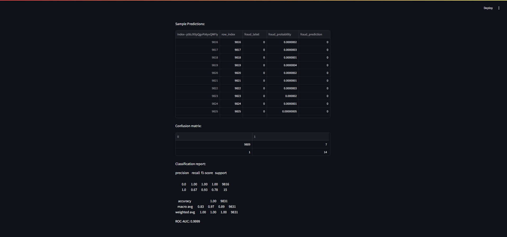
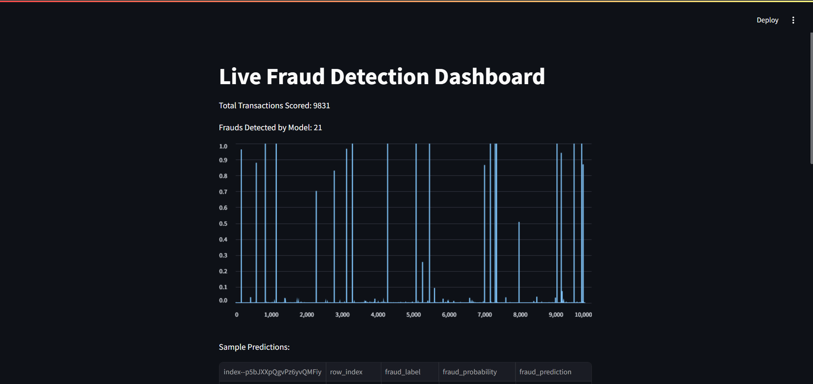

# End-to-End Credit Card Fraud Detection 🚀

## Overview

A beginner-friendly, real-time machine learning project for credit card fraud detection, with model deployment, API streaming, and a live monitoring dashboard.

---

## Project Structure

- `notebooks/` — EDA, modeling, and feature engineering notebooks
- `models/` — Final model artifacts (`fraud_xgb.joblib`)
- `app/api.py` — FastAPI app to serve predictions
- `simulate_stream.py` — Script to send X_test transactions to the API
- `app/dashboard.py` — Streamlit dashboard for monitoring
- `data/X_test.csv` — Test data with features and actual label (`Class`)
- `requirements.txt` — All dependencies
- `screenshots/` — Screenshots of API and dashboard

---

## How to Run (Step by Step)

1. **Clone this repo and install requirements**
git clone https://github.com/<your-username>/<your-repo>.git
cd fraud-detection-mlops
pip install -r requirements.txt

2. **Train and save the model using notebooks in `notebooks/`**
 - Export model to `models/fraud_xgb.joblib`
 - Add `Class` to `X_test` and save as `data/X_test.csv`

3. **Start the FastAPI server**
uvicorn app.api:app --reload

4. **Simulate transaction scoring (with streaming and logging)**
python simulate_stream.py

5. **Launch the Streamlit dashboard**
streamlit run app/dashboard.py

 - Open the browser link shown in the terminal.

---

## Example: API Prediction

Request:
{
"Unnamed: 0": 1,
"V1": 0.35,
"...": "...",
"TimeSinceLastTxn": 0.0
}

Response:
{
"fraud_probability": 0.001,
"fraud_prediction": 0
}

---

## Screenshots

---

## Results

- **ROC-AUC:** (add your value here)
- **Prec/Recall:** (add your value here)
- Real-time API and dashboard&nbsp;demo

---

## Credits

Built by [Your Name]. Beginner-friendly – see `README.md` for all steps!

---

## License

MIT
